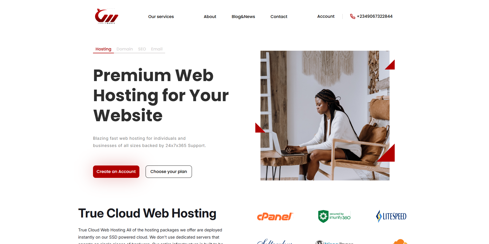
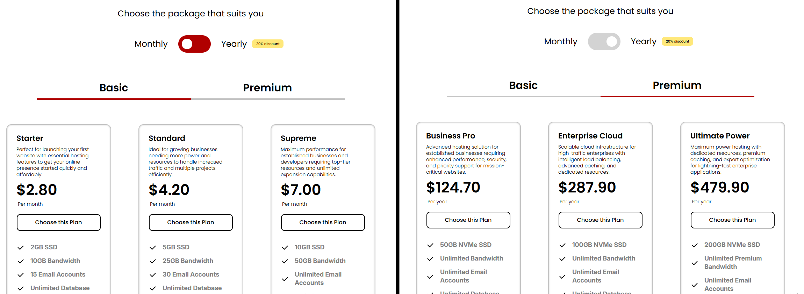
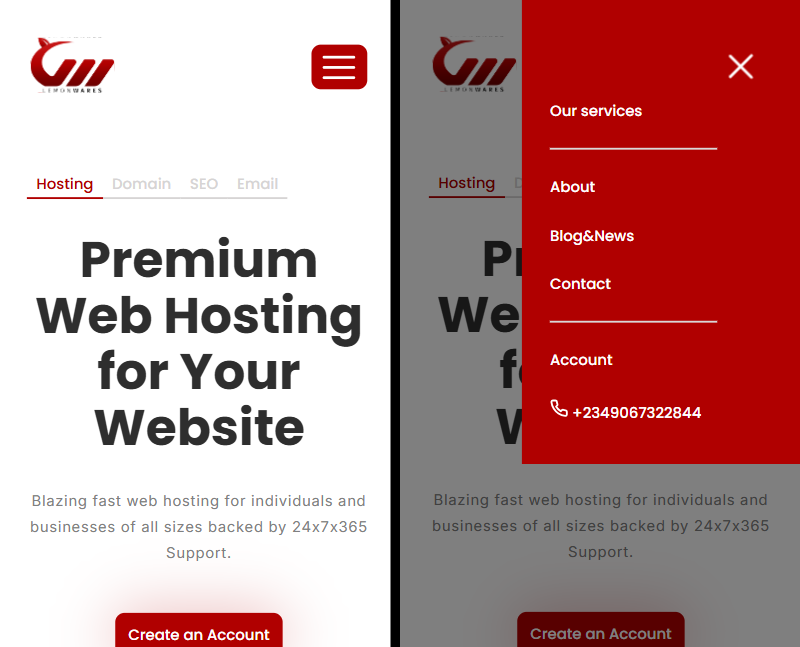
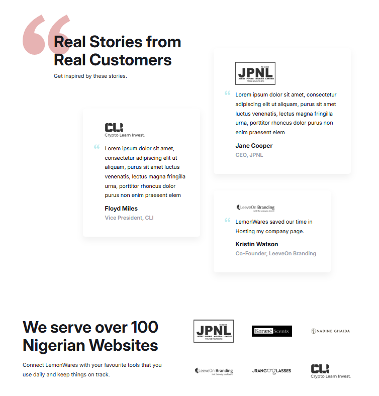

# Landing Page

## О проекте

Проект представляет собой адаптивную лэндинговую страницу, созданную по макету из Figma:
https://www.figma.com/community/file/1010010396670946771

Целью были практика верстки и перевод UI-дизайна в код.

## Особенности
- Адаптивная верстка (mobile, tablet, desktop)
- Бургер-меню для небольших устройств
- Интерактивные элементы (кнопки, табы)
- Чистая структура стилей с использованием SCSS (в проекте также оставлен файл style_old.css как файл стилей без использования препроцессоров)

## Технологический стек

- HTML
- SCSS (Sass)
- JavaScript

## Превью

## Демо

https://villerbond.github.io/landing-figma/
